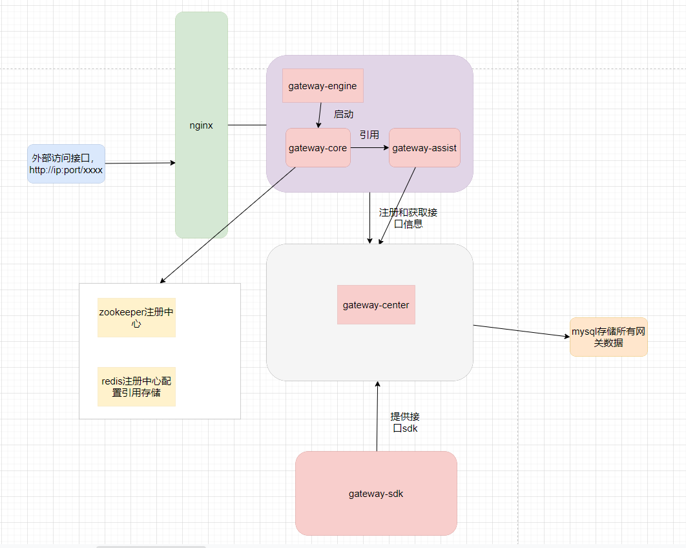
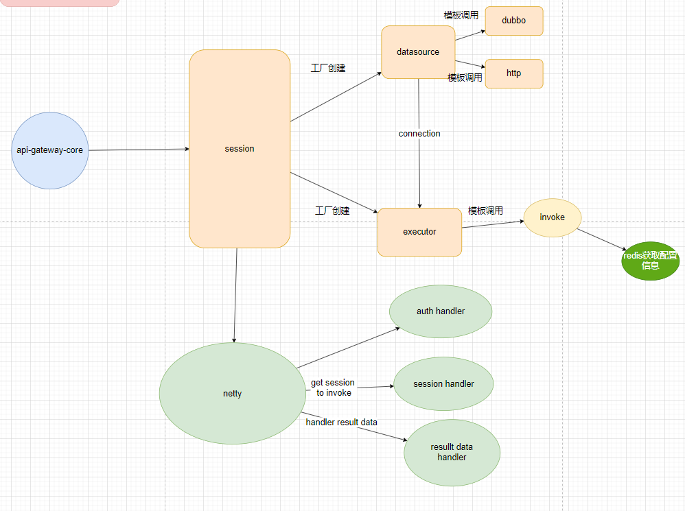
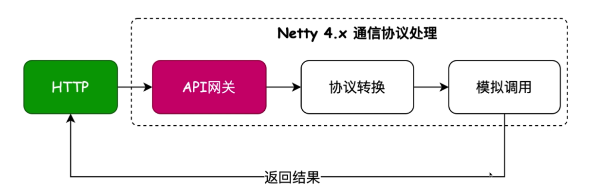
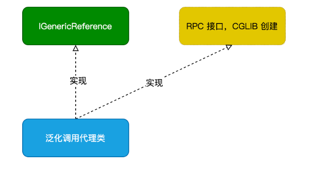
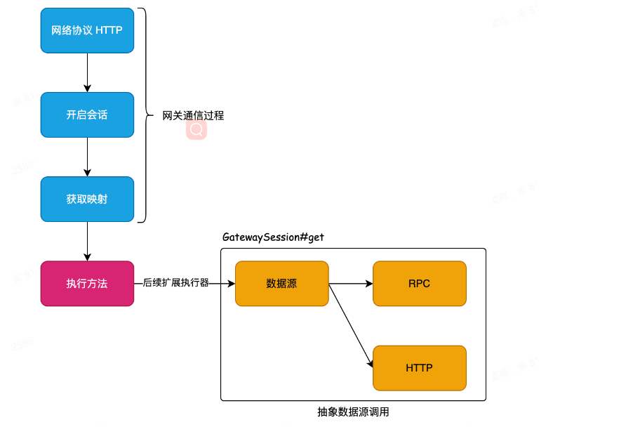
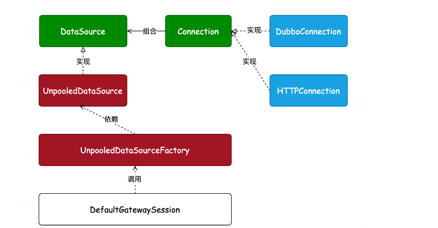
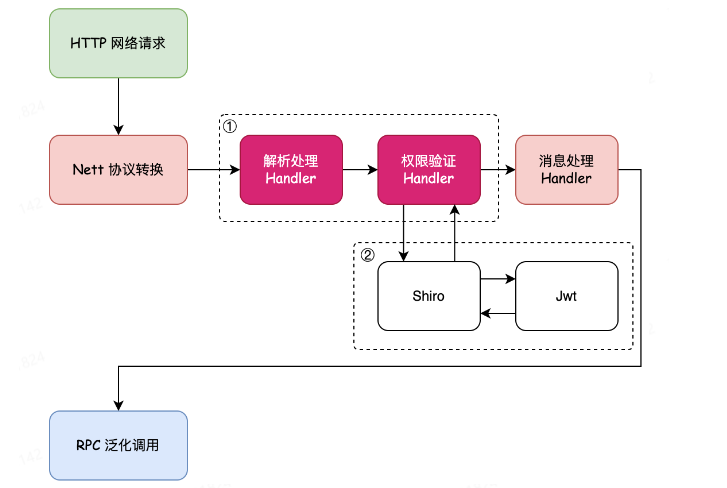

# 网关设计

### 基础架构

### core 模块的具体结构

这里将一次调用的流程进行拆分，把他分成为一个会话session，然后会话之中在根据调用信息进行拆分成为一个datasource和一个executor，datasource主要是根据他调用的类型进行初始化一个服务，比如dubbo的配置，以及http的配置等

然后在使用从executor中进行调用，executor是进行的泛化调用，根据datasource的类型配置进行对应的调用。

这里的netty处理拆分成为3部分，一部分主要是鉴权使用，一部分调用使用，最后一部分负责处理response的响应数据，然后进行返回。

至于基础的配置信息，全部信息放到mysql中，在启动的时候，center模块会把这部分信息进行一个注册，然后放到redis中，这样你在调用的时候就可以根据对应的接口信息查询出他对应的网关配置，然后进行调用。


API网关你可以理解为以前通过web mvc的方式给外部提供接口调用，只是对他的进行一个简易化实现，进行范化

具体过程：就是使用 SpringMVC 包装 RPC(Dubbo) 接口，对外提供 HTTP 接口的过程。


通常的基础设计类，如果一个类要实现不同种类实现不同种类的功能，并且都需要基于一个接口进行实现，或者说是基于一个父类进行实现，可以统一实现父类，或者定义一个基础的抽象类，转而定义抽象方法，然后下面的实现类在实现这个抽象方法


一个泛化调用通过代理进行，代理又使用工厂进行创建，在创建之前会进行先注册到注册中心，注册的配置包括参数，参数类型，接口名称，方法名等基础的配置信息

基本如下：



首先两个服务要想相互调用，必须要有连接，那么通过什么进行连接呢？我们这里通过注册中心zookeeper的方式进行连接，然后通过全类名的方式+方法进行在对应的注册中心查找对应的方法调用的类，然后在通过对应的参数类型，参数值通过cglib的方式进行动态代理他进行执行对应的方法。

这里的动态代理使用enhance的进行执行。


这里是一个例子：

主要在nettyServer中进行泛化调用，泛化调用在启动的时候就应该进行初始化配置，包括类，方法，将它放到一个map中，然后在调用方法的时候，通过配置将他的方法工厂取出来，通过工厂的方式进行创建，创建的过程中使用cglib的Enhance方式进行创建一个动态代理来执行这个方法，获取到其调用的结果，这样就是一个相对完整的rpc调用的过程。至于这个配置的过程启动是使用dubbo的配置方式启动，配置好他的注册中心，application和他的泛化服务

nettyServer：

```java
public Channel call() throws Exception {
        ServerBootstrap bs = new ServerBootstrap();
        ChannelFuture future = null;
        try {
            bs.group(boss,work)
                    .channel(NioServerSocketChannel.class)
                    .option(ChannelOption.SO_BACKLOG,128)
                    .childHandler(new SessionChannelInitializer(configuration));

             future = bs.bind(new InetSocketAddress(port)).syncUninterruptibly();
            this.channel = future.channel();
        } catch (Exception e) {
            logger.error("the socket server start occure error");
        } finally {
            if(null != future && future.isSuccess()){
                logger.info("the socket server start success");
                return channel;
            }else{
                logger.error("the socket server start error");
            }
            return channel;
        }
    }
```

这里主要还是使用工厂模式比较多，将这些对类的创建交给一个工厂来创建，每次要调用一个泛化服务接口的时候，直接从工厂里面创建一个对象就行了。

进一步抽象拆解过程



将这个调用过程变成一个会话的调用过程，每次过来请求的时候，将它拆解成为一个会话，直接从会话里面拿出具体的映射，在做代理，然后完成泛化调用即可

但是这里会遇到一个问题，就是我们每次一个请求过来的时候我们都会使用一个会话，其中会话是中会每次都启动一次dubbo的服务，相当于每次都做一次初始化，这样会造成资源的浪费，所以我们应该做一个类似于线程池的池化技术的优化。

类似如下：



​	额外处理Http请求，首先根据发送过来的请求对其进行处理，抽取出他需要处理的参数，然后把这些参数、类型参数名传递给要执行的方法即可。


接着引入一个执行期，负责对数据源的调用信息做处理


### 加入鉴权

这里使用shiro+jwt的方式对其进行鉴权操作。

具体在流程中的位置



这里主要是对于一些接口请求做鉴权操作，这里的操作主要创建一个对应的netty的handler来专门处理这个鉴权的流程。相当于把流程在划分明细一点，一个handler负责处理请求解析，一个负责处理鉴权，一个负责处理调用返回的数据解析操作等。

## 问题

dubbo和zookeeper连接不上，大部分是版本不匹配的问题，检查一下版本

